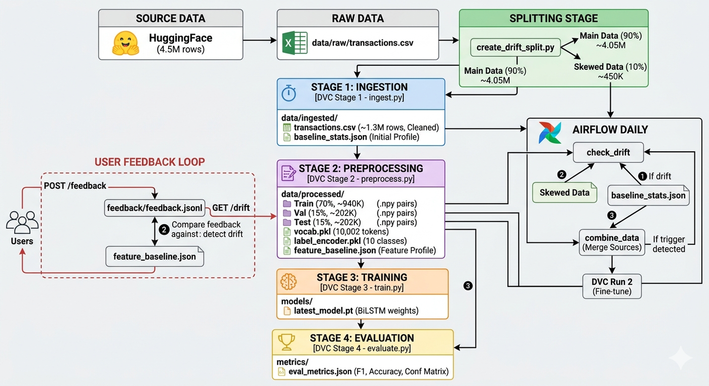
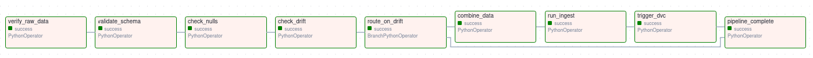
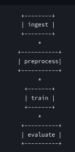
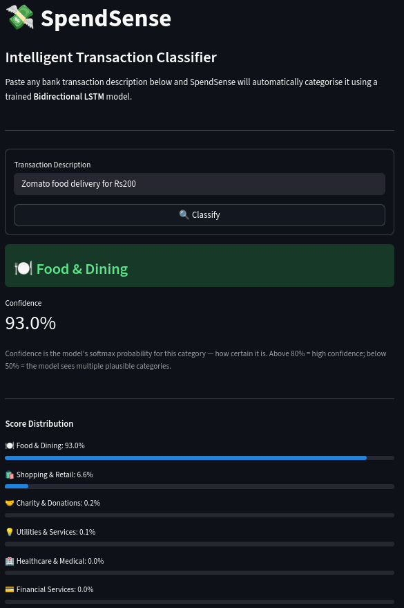
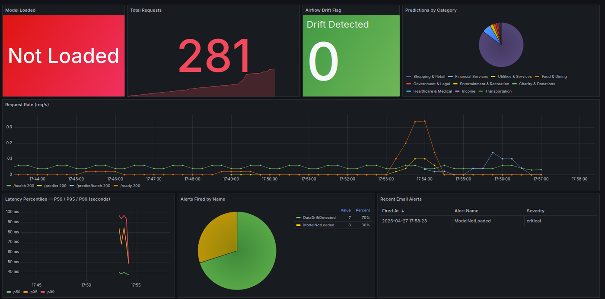
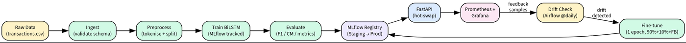
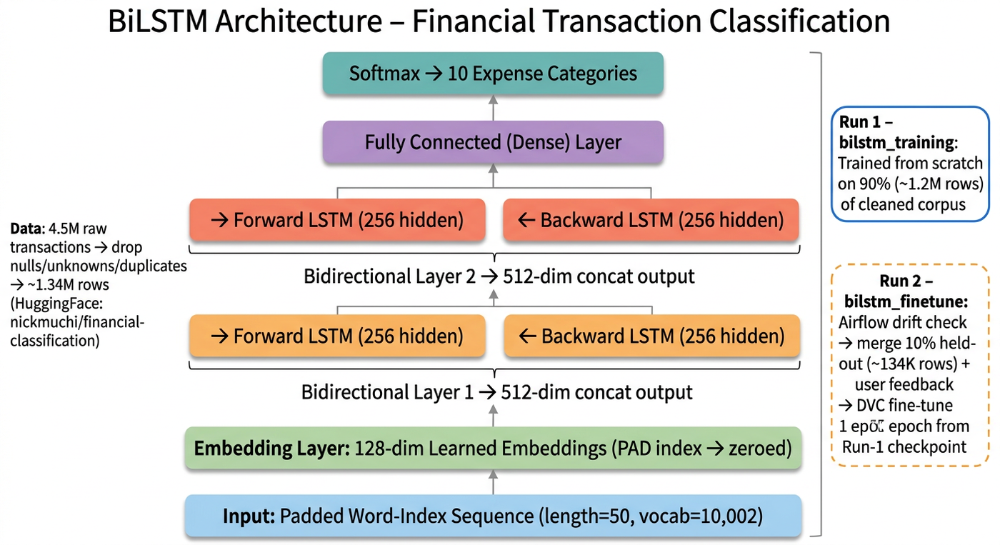
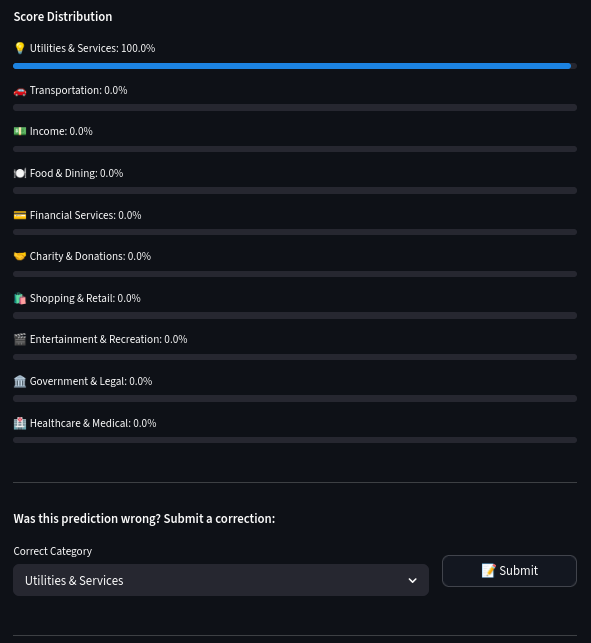
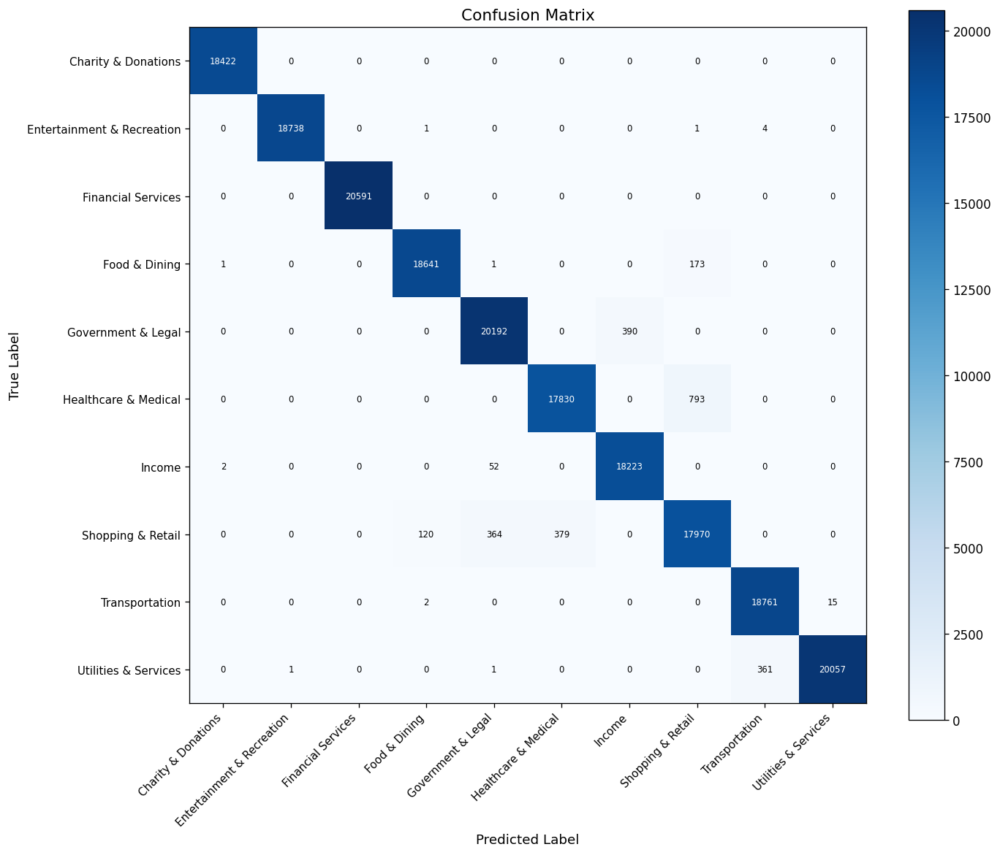

# SpendSense 

## What It Does

SpendSense reads a bank transaction description (e.g. "UPI-ZEPTO-ZEPTOONLINE@YBL-YESB0YBLUPI-606266723117-UPI") and automatically classifies it into one of 10 spending categories like Food & Dining, Transportation, Shopping, etc. In this case, the transaction would be classified as "Food & Dining". 

It is built with a full MLOps stack so the model can retrain itself when data patterns change.

---

## Dataset Exploration, Analysis & Preprocessing

The model is trained on the `nickmuchi/financial-classification` dataset from HuggingFace — real bank transaction narrations labelled across 10 spending categories.

### Data Pipeline



The diagram above traces the full journey of data through the system. Raw transaction data (4.5M rows) from HuggingFace is cleaned and deduplicated down to 1.34M rows. Before each CI run, this data is split 90/10: the 90% baseline undergoes a 70/15/15 train/validation/test split, gets tokenised and encoded into fixed-length sequences, and trains the BiLSTM. The 10% slice is intentionally skewed to simulate drift. When Airflow detects a distribution shift, all three sources — baseline, drift slice, and user feedback corrections — are merged and passed back through the pipeline for retraining.

### Raw Data Cleanup

The raw download contains ~4.5 million rows but is heavily duplicated. After removing nulls, filtering to the 10 valid categories, and deduplicating identical `(description, category)` pairs, **1,343,517 clean rows** remain.

| Stage | Rows |
|---|---|
| Raw download | ~4,500,000 |
| After cleanup (null removal + category filter + deduplication) | **1,343,517** |
| Eliminated | ~3,156,483 (~70%) |

The cleaned dataset is well-balanced — each category has between 130K and 138K rows:

| Category | Count | Example Transactions |
|---|---|---|
| Financial Services | 138,454 | Credit card payment, SIP, LIC premium |
| Government & Legal | 138,401 | Tax payment, passport fees, court fees |
| Utilities & Services | 137,366 | BESCOM bill, Jio recharge, internet |
| Shopping & Retail | 134,008 | Amazon, Flipkart, Myntra |
| Food & Dining | 133,932 | Zomato, Swiggy, restaurant bill |
| Transportation | 133,799 | Uber, Ola, petrol pump |
| Entertainment & Recreation | 133,570 | Netflix, BookMyShow, gaming |
| Healthcare & Medical | 132,582 | Apollo pharmacy, lab tests |
| Charity & Donations | 131,232 | NGO donation, temple donation |
| Income | 130,173 | Salary, freelance payment, refund |

**Average transaction description length:** 25.3 characters.

### CI/CD Drift Simulation

Before each CI run, the full raw dataset is split into a **90% baseline file** (stratified, used for Run 1 training) and a **10% drift file** (intentionally skewed — the top 3 categories are oversampled to 75% of the slice). This skew guarantees a >10 percentage-point distribution shift, which triggers the Airflow drift alert on every CI run and exercises the full retraining loop.

### Training, Validation & Test Split

The 90% baseline data is split into three sets (stratified to preserve category proportions):

| Split | Fraction | Approx. Rows |
|---|---|---|
| Train | 70% | ~940,000 |
| Validation | 15% | ~202,000 |
| Test | 15% | ~202,000 |

Each description is lowercased, punctuation-stripped, and tokenised into words. A vocabulary of 10,000 words (plus `<PAD>` and `<UNK>`) is built from the training set only. Every description is then encoded as a fixed-length sequence of 50 integer tokens — shorter descriptions are padded, longer ones are truncated. Most transaction narrations are 3–5 meaningful words, so the 50-token limit covers over 99% of inputs.

### Retraining Data Merge

When drift is detected, Airflow combines three data sources into a single training file: the 90% baseline (~4.05M rows), the 10% drift slice (~450K rows), and any user-submitted feedback corrections. The merged file (~4.5M rows total) is then passed through the full DVC pipeline as **DVC Run 2**, which fine-tunes the Run 1 model for 1 epoch rather than retraining from scratch.

---

## System Architecture


---

## Layer 1 — GitHub Actions (CI/CD Pipeline)

Every time code is pushed to `main`, GitHub Actions runs three jobs automatically:

- **Job 1** (~30s): Checks code style (flake8) and runs all unit tests. Runs on every branch.
- **Job 2** (~11.5 min): 
  - DVC Run 1: Trains the model on 90% of data, keeps the remaining 10% as drifted data, 
  
  - DVC Run 2: Triggers Airflow to validate data and check for drift using 10% drifted data, then re-trains on the combined original and drifted data (90%+10%) along with user feedback. Both runs are logged to MLflow along with their artifacts.
- **Job 3** (~1 min): Starts the backend and frontend in Docker and smoke-tests all API endpoints. Runs on the `main` branch only.

Everything runs on a local GPU machine — no cloud services are used.

---

## Layer 2A — Apache Airflow (Periodic Drift Detection)

Airflow runs a pipeline every day to check if new transaction data looks different from what the model was trained on (called "data drift").

**9-step pipeline:**



- If drift is detected (>10 percentage-point shift in category distribution), it merges new data with the original training set and triggers retraining using the previous model as a starting point (warm start/fine-tuning).

---

## Layer 2B — DVC Pipeline (Reproducible ML Pipeline)

DVC manages the four-stage ML pipeline and ensures every run is reproducible.



**4 stages:** `ingest → preprocess → train → evaluate`

- All settings (epochs, batch size, etc.) live in `params.yaml`.
- `dvc.lock` records a hash of every input and output — so you can always recreate any past result exactly.
- Only changed stages re-run on `dvc repro`, saving time.
- **Run 1 (base training):** Full pipeline on the original dataset — `ingest` loads raw transactions, `preprocess` splits 70/15/15, `train` fits the BiLSTM from scratch, `evaluate` scores the held-out test split.
- **Run 2 (fine-tune):** Airflow merges user feedback into the training set, then the same pipeline runs again with `FINETUNE_MODEL_PATH` pointing to the Run 1 model — only 1 epoch of weight updates on the enlarged dataset instead of training from scratch.

---

## Layer 3 — MLflow (Experiment Tracking)

MLflow acts as a logbook for every training run.

- Records hyperparameters, per-epoch loss and F1 score, final test metrics, and a confusion matrix image.
- Automatically registers each new trained model to the `Staging` stage in the model registry.
- Runs in Docker on port 5000; data persists via a bind-mounted `mlruns/` folder.

---

## Layer 4 — docker-compose (Orchestrate Docker Services)

Eight containers run the full system: `mlflow`, `backend`, `frontend`, `airflow`, `prometheus`, `grafana`, `alertmanager`, `pushgateway`.

### FastAPI Backend (port 8000)

The backend loads the trained model on startup and serves predictions via REST API.

| Endpoint | What it does |
|---|---|
| `POST /predict` | Classify a single transaction description |
| `POST /predict/batch` | Classify many descriptions at once |
| `POST /feedback` | Submit a correction (actual vs predicted category) |
| `GET /drift` | Check if recent feedback shows distribution shift |
| `GET /models` | List all past training runs |
| `POST /models/switch` | Hot-swap to a different model version (no restart) |
| `GET /health` / `GET /ready` | Health checks |
| `GET /metrics` | Prometheus metrics endpoint |

### Streamlit Frontend (port 8501)



Three pages accessible in the browser:

- **Home**: Type a transaction, get a category prediction, see a confidence chart, submit feedback.
- **Batch Predict**: Upload a CSV, paste multiple descriptions, or upload an bank statement (.xls/.xlsx) — get all predictions at once with a downloadable results table.
- **Pipeline Status**: Live health grid for all services, Prometheus metrics, DVC pipeline diagram, and Airflow run history.

### Monitoring Stack



| Tool | Port | Purpose |
|---|---|---|
| Prometheus | 9090 | Scrapes metrics from backend every 10s |
| Pushgateway | 9091 | Receives metrics from batch jobs (training, Airflow, etc.) |
| Grafana | 3001 | 8-panel dashboard (latency, request rate, drift flag, alerts) |
| Alertmanager | 9093 | Fires email alerts for 11 rules (e.g. high error rate, drift detected) |

All 5 system components (backend, training, evaluation, Airflow, frontend) push or expose metrics. Alerts are sent via Gmail SMTP and resolve automatically once the triggering condition clears.

---

## How All the Pieces Connect

```
User
 │
 ▼
Streamlit Frontend (port 8501)
 │  REST API calls via BACKEND_URL
 ▼
FastAPI Backend (port 8000)
 │  loads artefacts from disk on startup
 ▼
BiLSTM Model + Vocab + LabelEncoder
 │
 ├── Prometheus /metrics → Prometheus (9090) → Grafana (3001)
 ├── Pushgateway (9091) ← training, evaluation, Airflow, Streamlit
 ├── Alertmanager (9093) → email alerts
 ├── MLflow tracking → MLflow server (5000)
 └── Data pipeline ← Airflow (8080) + DVC + GitHub Actions
```

---

## Data Flow

1. **Ingestion (Airflow):** Loads raw transaction CSV, validates for missing/malformed data, checks if transaction patterns have shifted, merges new data with user corrections, saves clean data ready for training.
2. **Preprocessing (DVC):** Converts transaction text into numbers (tokenization), builds a word dictionary (top 10K words), pads all sequences to length 50, splits data into train/validation/test sets (70/15/15), saves processed arrays and vocabulary.
3. **Training (DVC):** Trains the BiLSTM neural network on the processed data (or fine-tunes from a previous model checkpoint), logs all hyperparameters and metrics to MLflow, automatically registers the best model as ready for production.
4. **Evaluation (DVC):** Tests the trained model on held-out data, calculates accuracy and F1 score per category, fails the pipeline if F1 < 70% (quality gate), saves detailed metrics and confusion matrix.
5. **Serving:** Backend loads the trained model on startup, compresses it using INT8 quantization for ~4× memory savings, serves predictions through REST API endpoints (predict, batch-predict, feedback, drift check).
6. **Feedback Loop:** Users submit corrections via `/feedback` → logged to `feedback.jsonl` → system detects if feedback shows >10 percentage-point category shift → if detected, triggers retraining on combined original + feedback data.
7. **Monitoring:** All components report metrics → Prometheus scrapes every 10s → Grafana displays live dashboard → Alertmanager sends email on anomalies.

---

## High Level Design Summary



The diagram above shows the end-to-end system at a glance. GitHub Actions sits at the top and orchestrates everything — it triggers the ML pipeline via DVC and manages the infrastructure lifecycle. DVC runs the four-stage data-to-model pipeline: raw data is cleaned, split, tokenised, and used to train a BiLSTM. The trained model is logged in MLflow and served through a FastAPI backend, which the Streamlit frontend calls for predictions. Airflow runs daily to check whether new data has drifted from the training distribution and fires a retraining run when it has. Prometheus and Grafana monitor all services in real time, with Alertmanager sending email alerts when something goes wrong.

---

## ML Model



- **Architecture:** Bidirectional LSTM (2 layers, 256 hidden dim per direction → 512 effective)
- **Input:** Padded word-index sequence (length 50, vocab size 10,002)
- **Embedding:** 128-dim learned embeddings, PAD index zeroed
- **Output:** Softmax over 10 expense categories
- **Training data:** 4.5M raw transactions from HuggingFace `nickmuchi/financial-classification`; ~1.34M rows remain after dropping nulls, unknown categories, and duplicates
- **Run 1:** Full training from scratch on 90% of the cleaned corpus (~1.2M rows), logged as `bilstm_training`
- **Run 2:** The remaining 10% (~134K rows) is a held-out batch that simulates newly arrived data and has class distribution drift from the original 90% data. Airflow checks it for drift, merges it with the 90% training set and the user feedback collected using the frontend, then DVC fine-tunes for 1 more epoch from the Run-1 checkpoint, logged as `bilstm_finetune`
- **Performance:** test macro F1 = 98.72%, test accuracy = 98.75%
- **Inference:** Dynamic INT8 quantization on LSTM and Linear layers at load time (~4× memory reduction)

---

## CI/CD Design


Every push to `main` triggers a 3-job automated pipeline that takes ~13 minutes end to end.

**Job 1 (~30s) — runs on every branch:** Checks code style with flake8 and runs all 68 unit tests. Fails if code coverage drops below 60%.

**Job 2 (~11.5 min) — main branch only:** This is the full ML pipeline. First, the 1.34M cleaned rows are split 90/10 — the 10% is the drift batch. Docker Infrastructure services (MLflow, Prometheus, Grafana, Alertmanager, Pushgateway) are started. DVC Run 1 trains the model on the 90% data and must pass an F1 ≥ 0.70 gate. Then Airflow is triggered: it validates the 10% drift batch, detects the distribution shift, and merges it with the 90% data plus any collected user feedback. DVC Run 2 fine-tunes the model (from Run 1 checkpoint) on this combined dataset for 1 epoch. Trained artifacts are saved locally for Job 3.

**Job 3 (~1 min) — main branch only:** Picks up the saved artifacts, starts the backend and frontend inside Docker, and smoke-tests all API endpoints to confirm the full system is working end to end.

---

## Feedback Loop & Drift Detection



*Frontend UI allows users to correct misclassified transactions.*

*Users can submit corrections for misclassified transactions.*

When the model misclassifies a transaction, the user can correct it directly from the frontend. Each correction is saved and accumulates over time. The system periodically checks whether the corrections reveal a pattern — specifically, if any spending category has shifted by more than 10 percentage points from the original distribution. When such a shift is detected, the model is automatically retrained on the combined original data plus all collected corrections, so it adapts to real user behaviour without any manual intervention.

---

## Acceptance Criteria

| Criterion | Threshold | Status |
|---|---|---|
| Test macro F1-score | ≥ 0.70 | Achieved: 98.72% |
| Test accuracy | ≥ 0.70 | Achieved: 98.75% |
| API latency (p95) | < 200ms | Verified via Prometheus histogram |
| Unit test suite | All tests pass (0 failures) | 68/68 pass |
| Code coverage | ≥ 60% (CI gate) | ~70% observed; CI gate enforced with `--cov-fail-under=60` |
| Error rate in production | < 5% | Alertmanager `HighErrorRate` alert fires at > 5% |

---

## Test Report Summary

| Category | Total | Passed | Failed |
|---|---|---|---|
| Unit tests (pytest, 5 files) | 68 | 68 | 0 |
| Integration tests (S1–S8) | 8 | 8 | 0 |
| **Total** | **76** | **76** | **0** |

---

## Training & Evaluation Metrics

Metrics are evaluated on the held-out 15% test split of ~1.34M cleaned rows.

### Overall

| Metric | Value |
|---|---|
| Test Macro F1 | **98.69%** |
| Test Weighted F1 | **98.69%** |
| Test Accuracy | **98.69%** |

### Per-Class F1 Scores

| Category | F1 Score | Accuracy | Notes |
|---|---|---|---|
| Charity & Donations | 99.99% | 99.99% | Near-perfect — highly distinctive vocabulary |
| Entertainment & Recreation | 99.99% | 99.99% | Near-perfect |
| Financial Services | 99.99% | 99.99% | Near-perfect |
| Utilities & Services | 99.32% | 99.32% | Excellent |
| Food & Dining | 99.31% | 99.31% | Excellent |
| Transportation | 99.29% | 99.29% | Excellent |
| Income | 98.84% | 98.84% | Strong |
| Government & Legal | 97.78% | 97.78% | Minor overlap with Financial Services |
| Healthcare & Medical | 96.96% | 96.96% | Some confusion with Shopping & Retail |
| Shopping & Retail | 95.45% | 95.45% | Lowest — broadest category, overlaps with Entertainment |

Shopping & Retail scores the lowest (95.45%) because it is the broadest category — gym memberships, online pharmacies, and multi-category retailers share merchant names with both Entertainment & Recreation and Healthcare & Medical. Government & Legal and Financial Services show a narrow band of mutual confusion, primarily around fee-based transaction narrations.

### Confusion Matrix



The matrix shows strong diagonal dominance across all 10 classes. The only notable off-diagonal activity is between Shopping & Retail and Entertainment & Recreation, and between Healthcare & Medical and Shopping & Retail — categories that share merchant naming patterns such as gyms, online pharmacies, and general retail platforms.

---

## Code Coverage Report

Coverage from the latest CI run (`pytest --cov=src --cov=backend --cov-fail-under=60`):

| Module | Statements | Missed | Coverage |
|---|---|---|---|
| `backend/app/schemas.py` | 36 | 0 | **100%** |
| `src/models/model.py` | 19 | 0 | **100%** |
| `backend/app/monitoring.py` | 18 | 1 | 94% |
| `src/data/preprocess.py` | 88 | 6 | 93% |
| `src/data/ingest.py` | 68 | 9 | 87% |
| `backend/app/main.py` | 151 | 56 | 63% |
| `backend/app/predictor.py` | 157 | 89 | 43% |
| **TOTAL** | **537** | **161** | **70%** |

The CI gate is 60% and the build achieves 70%. `predictor.py` scores lowest (43%) — the MLflow download paths need a live server, so they are tested with mocks only. `train.py` and `evaluate.py` are excluded entirely because they need a full GPU pipeline run to execute meaningfully.

---

## Major Problems & Critical Bugs

### 1. Airflow REST API returning 403

Airflow 2.9 only accepts session auth by default. CI's Basic Auth trigger was silently rejected. Fix: set `AIRFLOW__API__AUTH_BACKENDS=basic_auth,session` and `DAGS_ARE_PAUSED_AT_CREATION=False` on the Airflow service — without the second, freshly registered DAGs start paused and runs stay queued forever.

### 2. DataDriftDetected alert never fired

Airflow tasks push metrics one by one. The last task was unknowingly overwriting the drift metric set by an earlier task, so the alert never saw it. The issue was that `push_to_gateway` replaces everything on each push. Switching to `pushadd_to_gateway` fixes it — each push only updates its own metrics and leaves the rest untouched.

### 3. File Permission Error in Airflow Container

Airflow runs as a different system user than DVC. When Airflow tried to overwrite files written by DVC, it was blocked. The fix is to delete the folder entirely and recreate it fresh before writing — since the folder itself is open to all users, this sidesteps the permission issue.

### 4. CI Artifact Transfer Between Jobs Was Slow

GitHub's upload/download artifact API added 40+ seconds for the ~30 MB model payload. Fix: since the runner is self-hosted (same machine), stage files to `$HOME/ss-ci-$GITHUB_RUN_ID/` and copy with `cp` instead. (`$RUNNER_TEMP` is wiped between jobs — `$HOME` persists.)

### 5. Streamlit Example Button Not Pre-filling Input

Example buttons on the Home page sometimes didn't pre-fill the input. `session_state.pop()` was clearing the value before the form re-rendered. Fix: read with `session_state.get()` and only call `pop()` inside `if submitted:` — so the value persists through the button-click rerun.

---

## Design & Implementation Choices

### Why Pushgateway instead of direct Prometheus scraping?

Prometheus pulls metrics from a live `/metrics` endpoint. Long-running services like the FastAPI backend expose one natively. But batch jobs — DVC training, evaluation, Airflow tasks — exit after a few minutes, long before Prometheus next scrapes. Pushgateway acts as a persistent store: jobs push metrics to it on completion, and Prometheus scrapes the gateway. This is the standard pattern for monitoring batch ML pipelines.

### Why FastAPI instead of MLflow's built-in serving?

MLflow's built-in server (`mlflow models serve`) exposes a single fixed `/invocations` endpoint. It provides no control over response shape, Prometheus metrics, feedback collection, drift detection, model hot-swap, or health probes. FastAPI gives full control over all 9 endpoints. MLflow is still used for what it does best — experiment tracking and the model registry. The `POST /models/switch` endpoint satisfies "MLflow APIification" by downloading and hot-swapping any MLflow run's model without a container restart.

### Why GitHub Actions for CI/CD?

GitHub Actions triggers automatically on push with no external webhook setup. Its self-hosted runner flag lets the same YAML run on a local GPU machine, avoiding cloud costs while keeping full CI capability. The `needs:` dependency key enforces strict job ordering — Job 3 never runs unless Job 2 passes. Secrets (`ALERTMANAGER_SMTP_PASSWORD`, `GITHUB_PAT`) are stored in GitHub's secrets vault and injected at runtime, never hardcoded.

### Why CI/CD at all?

Without CI, quality checks are manual and routinely skipped under time pressure. Three automated gates enforce correctness on every push:
- **Code quality (Job 1):** flake8 + 60% coverage — fails before any GPU time is spent.
- **ML quality (Job 2):** `test_f1_macro < 0.70` fails the build — the broken model never reaches the app.
- **Integration (Job 3):** smoke tests verify the model actually loads and serves — catching packaging errors that metric checks alone miss.

### Why BiLSTM instead of a Transformer?

Transaction descriptions are short (typically 3–8 tokens after prefix stripping) and do not require long-range attention. BiLSTM captures bidirectional context efficiently at far lower parameter count and inference cost. Transformers would require a pretrained model (BERT/DistilBERT) and GPU memory at inference time — both are constraints on a local on-prem deployment. The 98.69% macro F1 shows BiLSTM is more than sufficient for this task.

### Why DVC for the ML pipeline instead of plain shell scripts?

DVC tracks input/output MD5 hashes for every stage. If the data and code haven't changed, it skips the stage — this makes `dvc repro` idempotent and fast. Each stage's outputs are cached and versioned alongside the Git commit, so any prior pipeline state is reproducible with `git checkout <sha> && dvc checkout`. Plain shell scripts provide none of this: they re-run everything every time and have no version linkage to data or models.

### Why two separate DVC runs?

Run 1 trains a baseline model on the 90% data slice — it needs to converge from scratch. The 10% drift batch exists specifically to simulate newly arrived data that was not seen during initial training. Running Airflow between the two runs demonstrates the full production loop: drift detection → data merge → fine-tuning. If both runs used the same data, there would be no meaningful difference to show, and the retraining trigger would be synthetic rather than data-driven.

### Why Airflow in addition to DVC?

DVC manages the ML pipeline (training, evaluation, versioning). Airflow manages the *data* pipeline — the daily scheduled work of fetching new data, validating it, checking for drift, and deciding whether to trigger retraining. These are fundamentally different concerns: DVC is content-addressed and reproducible; Airflow is time-driven and event-driven. Combining both means the ML pipeline is reproducible and the data pipeline is observable, schedulable, and auditable.

### Why separate containers for each service?

Strict container separation means each service can be restarted, upgraded, or replaced independently. The backend container can be rebuilt with a new model without touching Prometheus or Grafana. Airflow can be wiped and rebuilt (clearing its DB) without affecting the MLflow run history. This also mirrors production patterns where services scale independently and have separate lifecycle management.